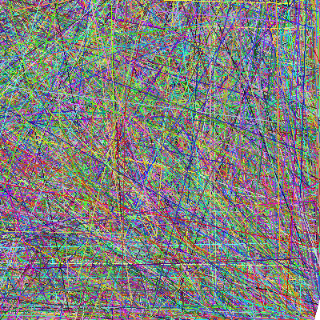

# Notes

Two minutes at the end of each session. What confused me, what fixed it.
Raw material for blog posts later — capture it while it's still confusing.
Also i dont care abut spelling in those Notes at all. Will do that in the blog.

Format, loosely:

## YYYY-MM-DD — phase N

**Stuck on:**

**What it turned out to be:**

**Still don't understand:**

## 25.9.26 — phase 1

I just finished my first gradiant after like 8h of implementing.
Challenging at the beginning borrow etc
but i already did some rust and also c knowladge is helping me

i really like rust, holy! It sounds weird, but some aspects of js i really like but most i dont
i feel like rust combines the controll of c and the good aspects of js. 
idk when i googled if i could implement multiply for my own struct i was mind blown that there is actually a way and its not even hacky.

so i really reallly love rust. 

also i couldnt test the whole time if my gradiant logic and all other stuff works. and to my suprise it all worked in a first atempt.

## 26.9.26 — phase 2

Drawing a line is harder than you think. claude gave me a link to a guide that explores the different attempts of trying to draw a line. because its harder than you think.
I then tried to implement it on my own without the guide and after some confusion i finally cracked the code. i managed to draw a line.
the code ended up the be already flawless. except to the fact it uses float divisions. thats something the tutorial gets rid of https://haqr.eu/tinyrenderer/bresenham/ and explores how it workes but it doesent look all to pretty. 
next ill work with the tutorial on how we can make it more accurate.
```rust
pub fn line(buffer: &mut FrameBuffer ,a: Coordinate, b: Coordinate, color: RGBA) {
    let vec = Vec2::calc_vector(a, b);
    let length = vec.calc_length() as u32;

    for t in 0..length {
        let t: f32 = t as f32 / length as f32;
        let p = a + vec * t;
        buffer.set_pixels(p, color)
    }
}
```

this is how the code currently looks. im exited on how the finished one will look like

## 29.9.26 — phase 2

optimizationsss

got rid of the floating point division in the loop by having a fix step size and also refactored that the vectors dont use f32 anymore
```rust
pub fn line(buffer: &mut FrameBuffer, mut a: Coordinate, mut b: Coordinate, color: RGBA) {
    if a.x > b.x {
        std::mem::swap(&mut a, &mut b);
    }

    let vec = Vec2::calc_vector(a, b);
    let steps =  vec.x.abs().max(vec.y.abs());
    let step_x: f32 = vec.x as f32 / steps as  f32;
    let step_y: f32 = vec.y as f32 / steps as f32;

    for t in 0..steps {
        let v = Vec2 {x:( t as f32 * step_x).round() as i32, y: ( t as f32 * step_y).round() as i32};
        let p = a + v ;
        buffer.set_pixels(p, color)
    }

    buffer.set_pixels(b, color)
}
```

this is how the code currently looks. note that i also always draw the line from left to right. this has to do with some roundings would be different depending on which direction.
the result of these changes: (1M random lines, 400x400, release): 317 ms → 253 ms (−20%)



after that i tried to optimize it the way bresenham does. he did something really smart to get rid of the float on y.
multiply everything by 2·dx = 20. Then all the fractions become whole numbers:

```
┌───────────────┬──────────┬─────────────┐
│     Float     │   × 20   │   Integer   │
├───────────────┼──────────┼─────────────┤
│ step 0.4      │ 0.4 × 20 │ 8 (= 2·dy)  │
├───────────────┼──────────┼─────────────┤
│ threshold 0.5 │ 0.5 × 20 │ 10 (= dx)   │
├───────────────┼──────────┼─────────────┤
│ subtract 1    │ 1 × 20   │ 20 (= 2·dx) │
└───────────────┴──────────┴─────────────┘
```

after 2h of refactoring this was the result:
```rust 
pub fn line(buffer: &mut FrameBuffer, mut a: Coordinate, mut b: Coordinate, color: RGBA) {
    let mut vec = Vec2::calc_vector(a, b);
    let steep = vec.x.abs() < vec.y.abs();

    if steep {
        std::mem::swap(&mut vec.x, &mut vec.y);
    }

    if vec.x <= 0 {
        vec = vec * -1;
        std::mem::swap(&mut a, &mut b)
    }

    //(vec.y / vec.x) * 2 * vec.x = 2 * vec.y
    let step_y  = vec.y.abs() * 2;
    let mut current_step_y = 0;
    let mut y = 0;

    for x in 0..vec.x {
        if current_step_y >= vec.x{
            if (vec.y < 0) {y -= 1} else {y += 1};
            current_step_y -= 2 * vec.x
        }
        current_step_y += step_y;

        let v = if steep {Vec2 {x: y, y: x} } else {Vec2 {x, y}};
        let p = a + v ;
        buffer.set_pixels(p, color)
    }

    buffer.set_pixels(b, color)
}
```
But to my suprise it was slower than before. it takes now 316 ms for 1m lines in comparison to the version before which needed only 250ms

so i thought what the problem could be and i moved a lot of stuff out of the loop:
```rust 
pub fn line(buffer: &mut FrameBuffer, mut a: Coordinate, mut b: Coordinate, color: RGBA) {
    let mut vec = Vec2::calc_vector(a, b);
    let steep = vec.x.abs() < vec.y.abs();

    if steep {
        std::mem::swap(&mut vec.x, &mut vec.y);
    }

    if vec.x <= 0 {
        vec = vec * -1;
        std::mem::swap(&mut a, &mut b)
    }

    let y_direction = if vec.y < 0 {-1} else {1};

    //(vec.y / vec.x) * 2 * vec.x = 2 * vec.y
    let step_y  = vec.y.abs() * 2;
    let mut current_step_y = 0;

    for _ in 0..vec.x {
        if current_step_y >= vec.x{
            if steep {a.x += y_direction} else {a.y += y_direction}
            current_step_y -= 2 * vec.x
        }
        current_step_y += step_y;
        buffer.set_pixels(a, color);

        if steep {a.y += 1} else {a.x += 1}
    }

    buffer.set_pixels(b, color)
}
```
another 2h later and to my suprise again it was almost identical 


```
┌───────────────────────────────────────┬────────┐
│                Version                │  Time  │
├───────────────────────────────────────┼────────┤
│ float DDA (31f6c07)                   │ 250 ms │
├───────────────────────────────────────┼────────┤
│ Bresenham 1 (offset from a, with x/y) │ 316 ms │
├───────────────────────────────────────┼────────┤
│ Bresenham 2 (running point, now)      │ 322 ms │
└───────────────────────────────────────┴────────┘
```

And for me it somehow made sense, as i was rewriting i added variable after variable and it felt way less efficient, but i thought no floats would outweight this.

after asking claude he was also suprised and thought the same. this way we add dependencies to the calculation from the last pixel and floating point multiplications got way more efficient on modern cpus.
so its probably still way more effiecient on older cpus and arduinos etc.

as of now i decided to commit it and go back to the float DDA as i find it better to read. but i will keep it in the back of my head for when i run it via webasembly to see what is faster